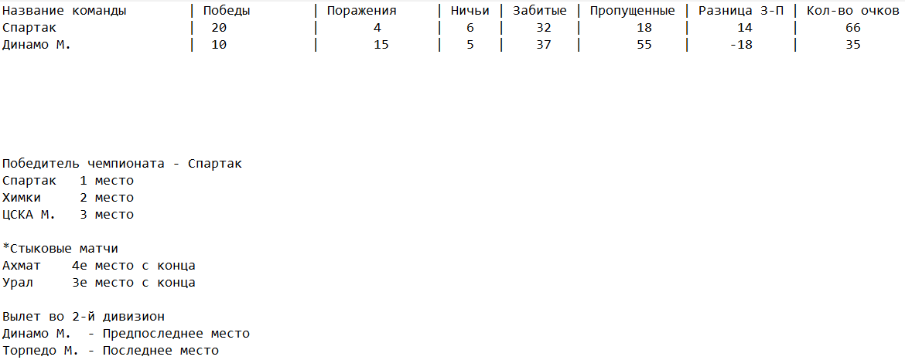

# Домашняя работа до 20.02.25 (1)
## Задание
В программу реализующую чемпионат России по футболу добавить Вывод таблицы чемпионата и его результатов на экран( по образцу из файла). Если потребуется доработать класс Бинарное дерево и структуру его узлов, для более удобного построения такой таблицы.
## Образец вывода
