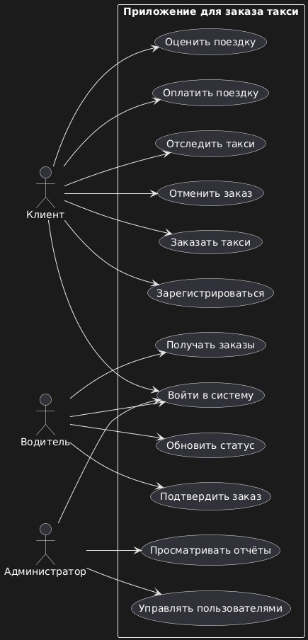
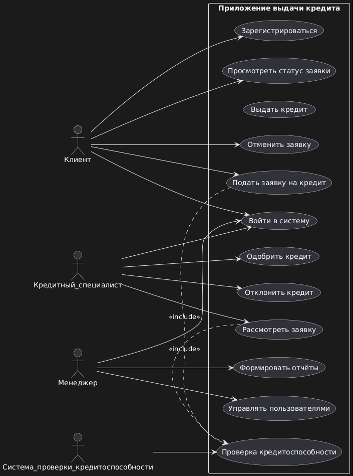

# Домашнее задание до 27.03.25
## Задание 1
Создать use-case диаграмму для приложения по заказу такси. Выделить роли и соответствующий им функционал. Нарисовать диаграмму. В качестве ответа прислать диаграмму в формате png.Оцениваться будет полнота анализа (насколько глубоко учли роли и функционал), наличие связей, корректность связей, а также читабельность диаграммы (общая аккуратность).
## Задание 2
Создать use-case диаграмму для приложения по выдаче кредита. Выделить роли и соответствующий им функционал. Нарисовать диаграмму. В качестве ответа прислать диаграмму в формате png. Оцениваться будет полнота анализа (насколько глубоко учли роли и функционал), наличие связей, корректность связей, а также читабельность диаграммы (общая аккуратность).
# Выполненые задание
## Задание 1

## Задание 2
