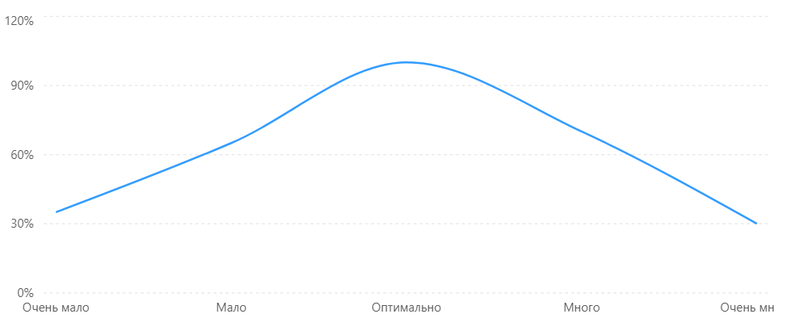

# Домашнее задание до 17.03.26
Опишите правила проведения совещаний. Как рекомендуется управлять доступом разработчиков к артефактам проекта? Изобразите графически и опишите зависимость эффективности работы разработчика от объема общения с коллегами.
## Ответ
## 1. Правила проведения совещаний

Эффективное совещание в программном проекте должно проводиться по следующим правилам:

1. **Четко определить цель совещания** — все участники должны понимать, зачем проводится встреча.
2. **Подготовить повестку дня** — заранее составить список вопросов для обсуждения.
3. **Приглашать только необходимых участников** — на совещании должны быть только те, кто действительно нужен для решения вопросов.
4. **Соблюдать регламент времени** — встреча должна начинаться и заканчиваться вовремя.
5. **Назначить ведущего** — он контролирует ход обсуждения и соблюдение регламента.
6. **Фиксировать принятые решения** — необходимо вести протокол совещания.
7. **Определять ответственных и сроки** — по каждой задаче должен быть назначен исполнитель и срок выполнения.
8. **Избегать лишних обсуждений** — не отклоняться от темы совещания.
9. **Рассылать итоги встречи** — после совещания протокол отправляется всем заинтересованным участникам.

---

## 2. Управление доступом разработчиков к артефактам проекта

**Артефакты проекта** — это требования, исходный код, документация, модели, тесты, планы проекта и другие результаты работы команды.

Рекомендуется управлять доступом к артефактам проекта следующим образом:

1. **Ролевое разграничение доступа**

   Каждый участник проекта получает права в соответствии со своей ролью и обязанностями.

   Например:

   - разработчик имеет доступ к исходному коду;
   - тестировщик — к тестовой документации;
   - аналитик — к требованиям;
   - менеджер проекта — к планам и отчетам.

2. **Централизованное хранение артефактов**

   Все артефакты проекта должны храниться в едином месте:

   - системе контроля версий;
   - системе управления проектами;
   - корпоративном хранилище документов.

3. **Контроль изменений**

   Все изменения должны фиксироваться, чтобы можно было определить:

   - кто внес изменение;
   - когда оно было внесено;
   - что именно было изменено.

4. **Использование систем контроля версий**

   Для исходного кода и документации рекомендуется использовать системы контроля версий, например **Git**.

5. **Использование ветвей разработки**

   Разработчики могут работать в отдельных ветках, а изменения добавляются в основную ветку только после проверки.

6. **Принцип минимально необходимых прав**

   Пользователь должен получать только те права, которые необходимы ему для выполнения текущих задач.

7. **Резервное копирование и защита данных**

   Необходимо регулярно создавать резервные копии и ограничивать доступ к важным данным проекта.

---

## 3. Зависимость эффективности работы разработчика от объема общения с коллегами

Эффективность работы разработчика зависит от количества общения с коллегами.

Существует следующая зависимость:

- **слишком мало общения** — разработчик может не знать актуальных требований, решений команды и изменений в проекте;
- **оптимальный объем общения** — разработчик получает всю необходимую информацию и работает наиболее эффективно;
- **слишком много общения** — постоянные совещания и обсуждения отвлекают от выполнения задач.

Графически эту зависимость можно представить как перевернутую параболу:

```text
Эффективность
     ^
100% |               *
 90% |            *     *
 80% |          *         *
 70% |        *             *
 60% |      *                 *
 50% |    *                     *
 40% |  *                         *
 30% | *                           *
     +------------------------------------>
        Мало      Оптимум       Много
                 общения
```


