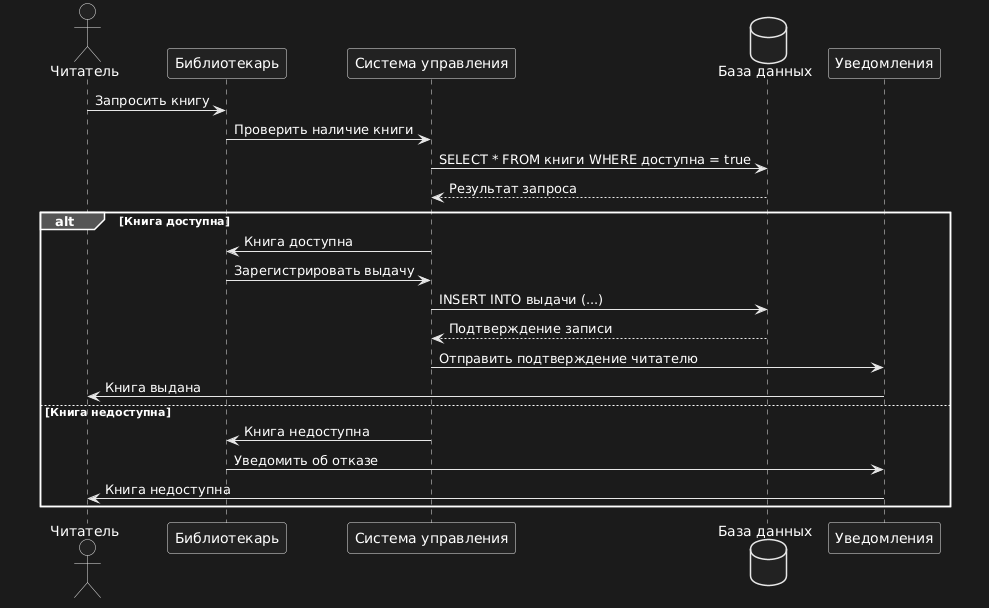
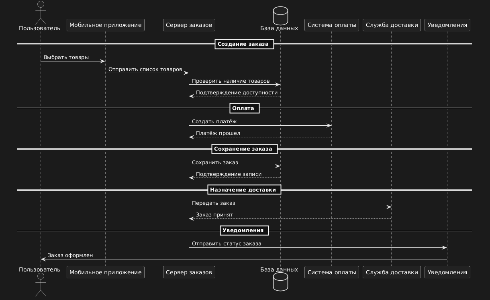
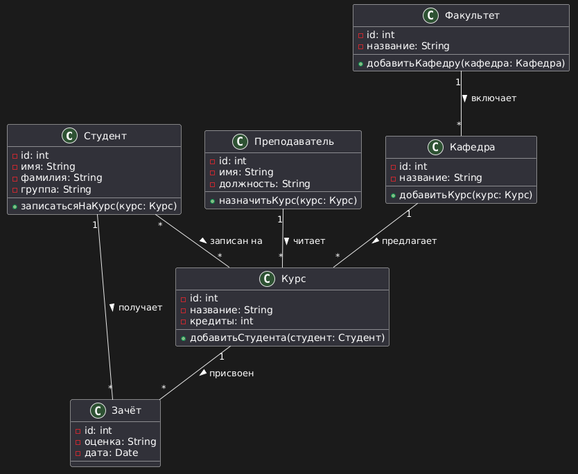
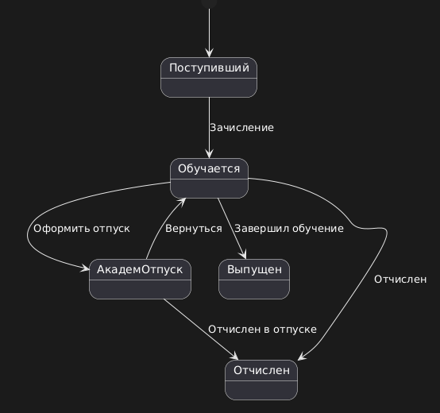
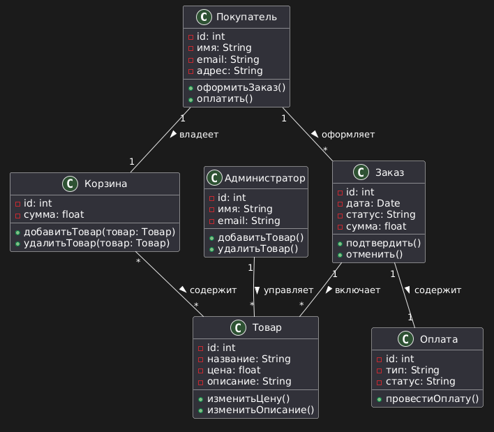

# Домашнее задание за 04.04.25
## Задание 1
1) Доделать диаграмму последовательности для выдачи книги в библиотеке. Объекты: 
 - Читатель (как внешний фактор)
 - Библиотекарь
 - Система управления
 - База данных
 - Дополнительно: на ваше усмотрени
## Задание 2
1) Сделать диаграмму последовательности для заказа продуктов в приложении (поаналогии с сервисами “Самокат”, “Яндекс Лавка” и т.п.)
 - Самостоятельно подобрать необходимые объекты
 - Построить линии жизни и фокусы управления
 - Определить сообщения
## Задание 3
1) Доделать диаграмму классов для базы данных университета.
2) Сделать диаграмму состояний для одного из классов задания №1.
## Задание 4
Построить диаграмму классов для интернет-магазина. Подумайте, какие классы понадобятся для реализации модели интернет-магазина, а также какие атрибуты и операции будут у этих классов. Постройте диаграмму, используя эти классы и корректные связи между ними. 
# Выполненые задание
## Задание 1

## Задание 2

## Задание 3
### №1

### №2 (диаграмма состояний для класса "студент") 

## Задание 4
