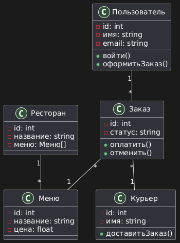
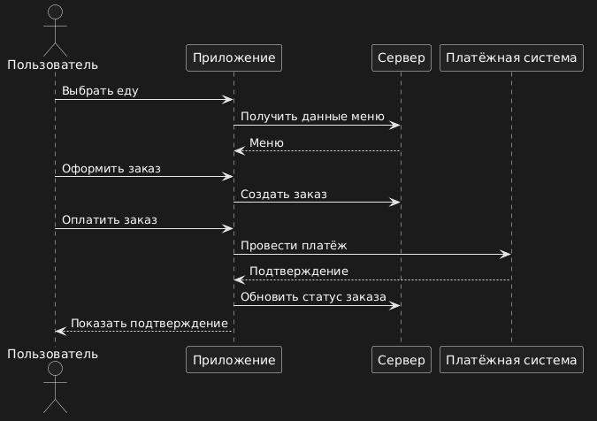
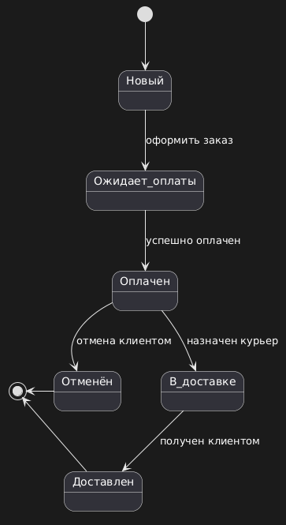

# Экзаменационное задание до 10.04.25
## Задание
Создать 5 разных диаграмм для любого ПО. Последовательность действий: 
1) Выбираете ПО, для которого будете составлять диаграммы. 
2) Придумываете, какие виды диаграмм вам понадобятся (минимум 5 видов) 
3) Рисуете эти диаграммы 
4) Складываете полученные диаграммы в архив и прикрепляете к ДЗ. В комментарии поясните, для какого ПО вы разработали диаграммы. 
## Выполненное задание для приложения доставки еды
### Диаграмма прецедентов

### Диаграмма классов

### Диаграмма последовательности

### Диаграмма состояний

### Диаграмма развёртывания
