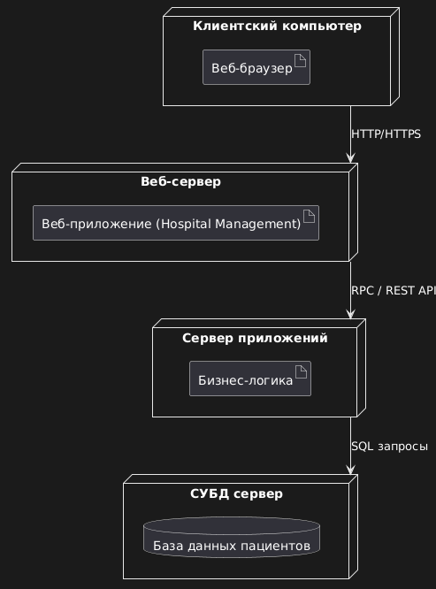

# Домашнее задание до 11.04.25
## Задание 1
Построить диаграмму развёртывания для системы управления больницей.
## Задание 2
На последнем занятии вас ждёт экзамен. Вам предстоит построить диаграммы на ваш выбор для вашего ПО. Описать ПО, для которого вы будете строить диаграммы. Выбрать типы диаграмм которые вам понадобятся при проектировании (минимум 5). Обосновать выбор.
# Выполненые задание
## Задание 1

## Задание 2
Я выбираю систему онлайн-бронирования авиабилетов. Это веб-приложение, которое позволяет пользователям искать и бронировать авиабилеты, управлять заказами, оплачивать билеты и получать уведомления. Для администраторов предусмотрена система управления рейсами, пользователями и отчетами.

Типы диаграмм:  
1) Диаграмма прецедентов, она нам нужна для визуализации всех пользователей системы и их основных действий. 
2) Диаграмма классов, нам будет нужна для моделирования структуры данных и взаимосвязей между основными сущностями.
3) Диаграмма последовательности, нужна для показа последовательности вызовов и обмена сообщениями между объектами во время операций таких как, процесс бронирования и оплаты билета.
4) Диаграмма состояний, нужна для описания жизненного цикла объекта, например, билета или заказа.
5) Диаграмма развёртывания, понодабиться для отображения физической структуры системы, также полезна для понимания инфраструктуры и развертывания.