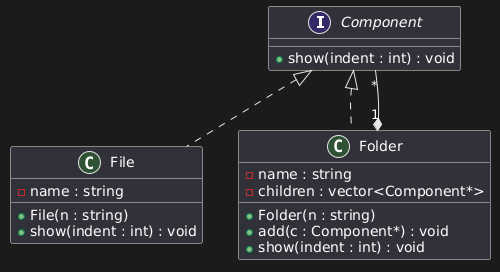
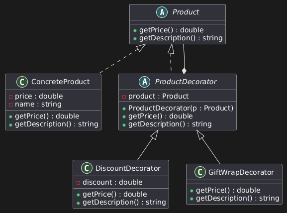
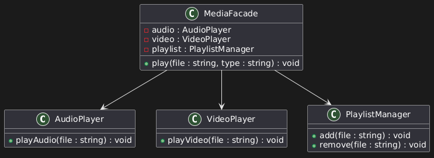

# Домашнее задание до 25.04.25-04.05.25
##  Задание
В качестве домашнего задания необходимо разработать три модели приложений, каждое из которых должно реализовывать хотя бы один структурный паттерн проектирования, описанный в текущем уроке. Каждая модель должна быть представлена в виде одной диаграммы классов, отражающей структуру классов, используемых этой моделью, а также связи, в которых состоят эти типы данных. Одну из созданных моделей (на выбор) необходимо реализовать в виде работающего приложения.
## Диаграммы классов
### Файловая система

### Магазин товаров со скидками

### Плеер

